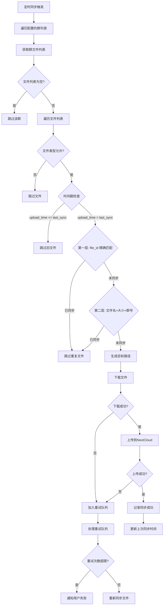
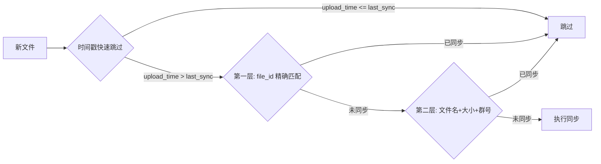

# FileSyncPlugin - QQ群文件同步NextCloud

QQ群文件自动同步到NextCloud私有云盘的AstrBot插件。

## 功能

- 定时扫描QQ群文件夹（支持间隔模式和时间点模式）
- 自动同步文件到NextCloud
- 支持多群配置
- 文件按类型分类存储（可自定义路径模板）
- 文件重名自动重命名
- 同步失败自动重试
- 增量同步（只同步新增文件）
- **三层去重策略**：时间戳快速跳过 + file_id 精确匹配 + 文件名+大小+群号 兜底检查
- **统一北京时间**：所有时间操作使用东八区时区
- **重试失败通知**：达到最大重试次数后通知用户
- **诊断日志**：记录同步过程中的详细决策信息，便于排查问题

## 核心逻辑



### 去重策略说明



## 命令

- `/同步文件` - 手动触发同步（增量同步）
- `/同步状态` - 查看同步状态（已同步文件数、待重试数）
- `/同步统计 [群号]` - 查看同步统计，支持按群号筛选；无参数时显示总览+分群统计
- `/同步调试` - 检查后端支持的 API 端点
- `/诊断日志` - 查看最近 20 条诊断日志
- `/清空诊断日志` - 清空诊断日志

## 配置

在AstrBot管理面板中配置以下选项：

| 配置项 | 说明 | 默认值 |
|-------|------|--------|
| `nextcloud_url` | NextCloud WebDAV地址 | - |
| `nextcloud_username` | NextCloud用户名 | - |
| `nextcloud_password` | NextCloud应用密码 | - |
| `enabled_groups` | 启用的群号列表，如 `["123456", "987654"]` | - |
| `base_path` | 云盘基础路径 | `/QQ群文件` |
| `path_template` | 文件夹路径模板 | `{group_name}_{group_id}/{file_type}` |
| `sync_interval_minutes` | 同步间隔（分钟），时间点模式下无效 | `1440` |
| `sync_time_points` | 同步时间点，格式 `["08:00", "12:00"]`，配置后覆盖间隔模式 | `[]` |
| `file_type_whitelist` | 允许的文件类型，如 `[".pdf", ".docx"]`，`["*"]` 表示全部 | `["*"]` |
| `notify_on_success` | 同步成功时通知 | `false` |
| `notify_on_error` | 同步失败时通知 | `true` |
| `retry_queue_enabled` | 启用失败重试队列 | `true` |
| `retry_max_attempts` | 最大重试次数 | `3` |
| `retry_delay_seconds` | 重试间隔（秒） | `300` |

## 路径模板

`path_template` 支持以下占位符：

- `{group_name}` - QQ群名称
- `{group_id}` - QQ群号
- `{file_type}` - 文件扩展名（小写），如 `pdf`、`docx`

### 示例

假设配置：
```json
{
  "base_path": "/QQ群文件",
  "path_template": "{group_name}_{group_id}/{file_type}"
}
```

同步到群「游戏群」(群号123456) 中的 `文档.pdf` 文件，最终路径为：
```
/QQ群文件/游戏群_123456/pdf/文档.pdf
```

## 安装

1. 将 `file_sync_plugin2` 目录复制到AstrBot插件目录
2. 在AstrBot管理面板中启用插件
3. 配置NextCloud连接信息和启用的群号
4. 使用 `/同步文件` 命令手动触发首次同步

## 项目结构

```
file_sync_plugin2/
├── __init__.py
├── main.py            # 主插件类
├── metadata.yaml      # 插件元数据
├── config.py          # 配置模型
├── requirements.txt   # 依赖
├── README.md          # 插件说明
├── models/            # 数据模型
│   └── sync_record.py
├── services/          # 核心服务
│   ├── cloud_sync.py      # NextCloud同步
│   └── state_manager.py   # 状态管理(SQLite)
└── utils/             # 工具函数
    └── rename.py      # 文件重命名
```

## 依赖

- `httpx >= 0.24.0` - HTTP客户端

## 开发

### 运行测试

```bash
pip install -r file_sync_plugin2/requirements.txt
pytest tests/ -v
```

## License

MIT
